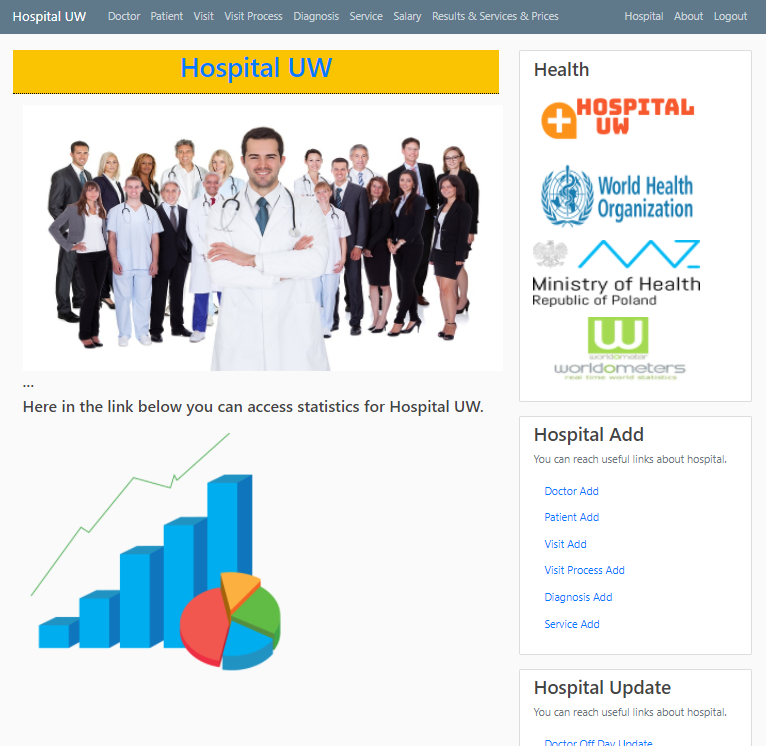

# Hospital UW Django Based Database Application 
University of Warsaw data science and business analytics master's program 1st semester PYTHON & SQL class term project.

## SignIn/Register System
Accounts data are hold in sqlite database system.
- There are 3 types of user in our system;
    - Admin.....usernumbers starts with `0`
    - Doctor....usernumbers starts with `1`
    - Patient...usernumbers starts with `2`
    
    > All three user groups have unique usernumber that given them before IT department to identify themselves. They used this
    usernumbers to register the system and system check if this user name are matched with their name and surname. So usernumbers
    need to be keep in secure.  

To create a password, there are some requirement,
1. Should have at least one number.
2. Should have at least one uppercase and one lowercase character.
3. Should have at least one special symbol.
4. Should be between 6 to 20 characters long.

User can log out after they finished their process from log our button.
> Also the system has keep the log of last session and keep the user of this session for security.                                                                                                          

## Home Page
In the home page, you can access;
- ``View`` buttons on top of the page in navigation bar, user can view the database information if they are authorized.
- ``Home``, ``About`` and ``Logout`` buttons on the right side of navigation bar.
- ``Health`` links to quick access some links like`WHO`, `Ministery of Health in Poland`. All users have authorization to access these links.
- ``Hospital Add``, ``Hospital Update``, ``Hospital Delete``and ``Useful Links``
- ``Statistics`` button in the middle of the page with a statistics figure.

## About Page
In about page, user can find contact information about the hospital,
> Users have access the ``Google Maps`` direction when they click the button in the contact section with a figure.

## Statistics Page
When user click the statistics button, every single click trigger the function to check database and create some plot visualization.
> With this method, our visualized plots are dynamic and up to date for every single click.

  
## User Accesses in Website
All links are visible for all user type but except admin, other user accounts have some restrictions to access the links.
- To add and delete the information from database, only `admin` account has authentication.
- To update ``doctor off day``, both `admin` and `doctor` accounts have authentication.
- To update ``patient phone``, both `admin` and `patient` accounts have authentication.
- To update ``service`` and ``salary``, only `admin` account has authentication.
- ``Useful Link`` part only accessible for `admin` accounts.
- ``Statistics`` part only accessible for `admin` accounts.
- ``Health`` fast links re accessible for all user types.
- ``Home&Hospital`` link is accessible for all user types.
- ``About`` link is accessible for all user types.
- ``Salary`` button accessible for both `admin` and `doctor` accounts but, if user is a doctor he/she can only access to 
his/her salary not the others.
- ``Results`` button accessible for all accounts but, if user is a `patient` he/she can only access to 
his/her result not the others.

## Demo Frame of Hospital UW

## Contributors

